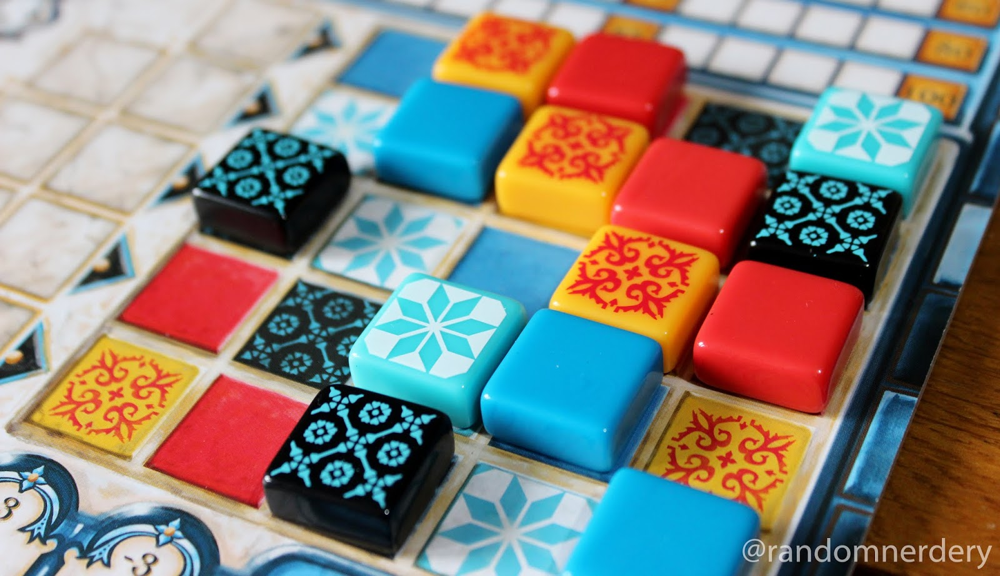

# Simulador del Juego Azul implementado en Prolog

[](https://opensource.org/licenses/MIT) [](https://github.com/lllrdgz/prolog-azul/commits) [](https://github.com/lllrdgz/prolog-azul/commits) [](https://github.com/lllrdgz/prolog-azul) [](https://github.com/lllrdgz/prolog-azul) [](https://github.com/lllrdgz/prolog-azul) [](https://github.com/lllrdgz/prolog-azul/graphs/contributors)

> Proyecto I de la asignatura de Programación Declarativa del curso 2022-2023 de la carrera de Ciencia de la Computación de la Universidad de La Habana.

<center></center>

## Autor

* Leandro Rodriguez Llosa - C311 - [lllrdgz.cs@gmail.com](mailto://lllrdgz.cs@gmail.com)

## Descripción del Juego

### Componentes Básicas del Juego

**Azulejos:** Son una serie de piezas en cinco colores diferentes. El objetivo de los jugadores será obtener estos azulejos para conseguir conformar el muro que le han asignado.

**Fábricas:** Losetas circulares en las que se colocarán los azulejos en grupos de cuatro al comienzo de cada ronda. La cantidad de fábricas depende de la cantidad de jugadores.

El concepto básico es que **un jugador, al tomar piezas, siempre deberá tomar todas las de un mismo color que se encuentren en una ubicación concreta**. Estas ubicaciones serán las fábricas anteriores o el centro de la mesa, donde se irán colocando las losetas de las fábricas que no sean tomadas por un jugador al capturar las de un color concreto.

**Tablero Personal:** Cada jugador contará con uno y en dicho tablero encontramos los siguientes elementos:

* En la banda superior se encuentra el track de puntuación, con casillas numeradas de 0 a 99.
* En la zona inferior izquierda encontramos el espacio de preparación. Son cinco filas con un número diferente de columnas cada una (la fila superior solo tiene una posición y cada nueva fila tendrá una columna más hasta llegar a la última fila con cinco columnas).
* A la derecha encontramos el muro, compuesto por una cuadrícula de cinco filas y cinco columnas. En cada casilla de cada fila encontraremos impreso un tipo de azulejo, de forma que en ninguna fila y en ninguna columna se repite un mismo tipo.
* Por último, en la fila inferior, encontramos una fila de casillas con un valor negativo que aumenta en una unidad cada dos casilla. En esta fila se irán colocando los azulejos que no se puedan/quieran colocar en alguna de las filas de la zona de preparación.

**Ficha de jugador inicial:** Determina qué jugador será el primero en escoger en una ronda. Esta ficha, además, funcionará como un azulejo pero que siempre será colocado en la fila de penalización.

### Preparación de la Partida

1. Cada jugador recibe un tablero personal y un marcador de puntuación que colocará en la casilla de valor 0.
2. Se coloca, formando un círculo, un número de losetas de fábrica dependiente del número de jugadores:
    * 2 Jugadores: 5 Losetas de Fábrica.
    * 3 Jugadores: 7 Losetas de Fábrica.
    * 4 Jugadores: 9 Losetas de Fábrica.
3. Se introducen en la bolsa los 100 azulejos (20 de cada color) y se mezclan bien.
4. Se rellena cada loseta de fábrica con 4 piezas extraídas de la bolsa al azar.
5. Se escoge al jugador inicial del partido de forma aleatoria, en las siguientes rondas el jugador inicial, es quien escoja azulejos por primera vez del centro y no de las fábricas, y éste obtendrá la ficha de jugador inicial que debe ponerse en el suelo del tablero, restando puntos.

### Desarrollo de la Partida

Una partida de ***Azul*** consta de un número indeterminado de rondas hasta que se cumpla la condición de finalización.

#### Condiciones de Finalización

* Se acabaron todos los azulejos
* Un jugador al terminar la ronda completó una fila.

Cada ronda consta a su vez, de tres fases.

#### Fase I: Selección de Azulejos

Esta fase consta de una serie de turnos alternados entre los jugadores, comenzando por el jugador inicial y continuando en el sentido de las agujas del reloj hasta que finaliza la fase.

El turno de un jugador se desarrolla de la siguiente forma:

1. De forma obligatoria, el jugador debe tomar todos los azulejos de un mismo color de una de las ubicaciones posibles:
    * Si se toman de una fábrica, los azulejos de otros colores que no se cojan se desplazan al centro de la mesa.
    * Si se toman del centro de la mesa y es el primer jugador en tomar azulejos de esta zona, el jugador debe tomar, adicionalmente, la ficha de jugador inicial y colocarla en la primera casilla disponible de la fila de suelo. En la siguiente ronda será el jugador inicial en esta fase.
2. A continuación, el jugador debe colocar las losetas en alguna de las filas de su zona de preparación cumpliendo las siguientes normas:
    * Si la fila ya contiene algún azulejo, los nuevos azulejos a colocar deben ser del mismo color.
    * No se puede colocar azulejos de un tipo concreto en una fila de la zona de preparación si en la fila del muro correspondiente ya se encuentra un azulejo de ese tipo.
    * Si todos los azulejos no caben en la fila escogida, los sobrantes deben colocarse en la fila de suelo (empezando por la primera casilla libre situada más a la izquierda).
    * Es posible colocar directamente en la fila de suelo todos los azulejos escogidos en un turno de esta fase.

La fase finaliza tras el turno del jugador que ha tomado el último azulejo en juego, es decir, no quedan azulejos en ninguna fábrica ni en el centro de la mesa.

#### Fase II: Revestir el Muro

Esta fase es automática y se puede desarrollar en paralelo. Cada jugador transporta un azulejo de cada una de las filas completadas al muro, comenzando por la fila superior y continuando hacia abajo. Por cada azulejo colocado en el muro se anotan puntos en función de los azulejos directamente conectados en la fila y/o columna correspondiente:

* Si el azulejo no se coloca adyacente a ningún otro azulejo de forma ortogonal, se anotará 1 punto.
* Si el azulejo se coloca adyacente al menos un azulejo, se cuentan cuántos azulejos directamente conectados en línea recta en la fila y/o columna hay. Por cada azulejo en cada una de ambas rectas se anota un punto, incluyendo al azulejo recién colocado. Por ejemplo, si el azulejo colocado tiene 1 azulejo adyacente en la columna y 1 azulejo adyacente en la fila, el jugador anotó 4 puntos (2 azulejos en la fila y 2 azulejos en la columna).
* El resto de azulejos de cada fila completada se colocan en la tapa de la caja (visibles para todos los jugadores).
* Los azulejos que se encuentran en filas incompletas, permanecen en su posición para la siguiente ronda.
* Por último, los jugadores restan puntos según las losetas que se encuentran en su fila de suelo, retrasando su marcador tantos puntos como indique cada casilla ocupada.

La fase finaliza una vez todos los jugadores han anotado sus puntos.

#### Fase III: Mantenimiento

Si la partida no ha finalizado, se prepara la siguiente ronda, volviendo a sacar de la bolsa 4 azulejos por fábrica. Si la bolsa quedase vacía, en ese momento se re-introducirán todos los azulejos que se encuentran en la tapa de la caja a la bolsa y se continuaría reponiendo.

Puede darse el caso de que, aún reintroduciendo los azulejos de la caja no haya azulejos suficientes para reponer todas las fábricas. En este caso se repondrá hasta donde fuese posible.

### Fin de la Partida

La partida termina en la ronda en la que un jugador consigue completar una o más filas, o los azulejos se agotaron. A los puntos acumulados se suman los siguientes:

* 10 Puntos por cada color de azulejo que se haya completado (se tiene un azulejo de ese color en cada fila)
* 7 Puntos por cada columna completa
* 2 Puntos por cada fila completa.

El jugador con más puntos se proclama vencedor. En caso de empate, el jugador con más filas completadas será el ganador. Si la igualdad permanece, se comparte la victoria.

## Implementación

Uno de los aspectos más importantes a destacar en el proyecto es el tratamiento de los estados del juego. Teniendo en cuenta que la programación lógica gira en torno al concepto de predicados, y estos sirven para guardar información; Prolog sirve como una base de datos de estados lógica, donde cada estado se puede transformar a otro, bajo ciertos parámetros de entrada.

En otras palabras, digamos que todo predicado que se almacene en dicha base de datos lógica, define una gramática regular la cual con definir un [FST (Finite State Transducer)](https://en.wikipedia.org/wiki/Finite-state_transducer) se logra transducir un estado en otro, declarando cómo se relaciona el estado actual del predicado y otros parámetros de entrada, con el estado resultante.

Bajo esta idea, cualquier predicado que se pueda declarar con la lógica de primer nivel o lógica de clausulas definidas, en Prolog, puede ser considerado un `FST` de los predicados que este transforma. Utilizando un poco de Meta Programación es posible construir un predicado que literalmente modifique el estado de otro. (tenga en cuenta que el predicado que esta siendo modificado está definido como `dynamic`)

```prolog
transducer(MetaPredicate, Transducer, Args) :-
    
    MetaPredicate_Transducer=..[Transducer,
        MetaPredicate, MetaPredicate_Modificated,Args],
    call(MetaPredicate_Transducer),
    
    assert(MetaPredicate_Modificated),
    retract(MetaPredicate), !
.
```

### Estrategia implementada

La estrategia implementada para escoger la jugada fue calcular los puntos que se obtenían con cada jugada posible, escogiendo la jugada con la que se obtenía mayor cantidad de puntos.

Queda pendiente terminar la implementación del jugador aleatorio, para así poder hacer juegos con diferentes tipos de jugadores. El proyecto es lo suficientemente extensible para variar esto, y otros aspectos más interesantes como la cantidad de azulejos, fábricas, dimensiones de los muros, etc.

## Manual del Simulador

### Requerimientos

Es necesario tener instalado `swi-prolog` para utilizar el simulador. Puede encontrar las instrucciones para su instalación en el siguiente [enlace](https://www.swi-prolog.org/Download.html).

### Correr simulación

Una vez cumplidos los requerimientos para correr la simulación debe ejecutar el comando `make` en el directorio raíz del simulador. Luego dentro del entorno de `swi-prolog` debe introducir `new_game(Players).`, donde `Players` es la lista de jugadores a enfrentarse. Por el momento solo está implementada la estrategia del jugador goloso, por tanto la lista debe ser algo parecido a esto `[greedy, greedy]`, siendo válida de `2` a `4` jugadores.

El resultado de la simulación se mostrará en un archivo que se encuentra en `/docs/game.txt` partiendo del directorio raíz del proyecto. Este tendrá la descripción de cada jugada realizada y el estado resultante después de realizada esta, hasta la finalización del juego que se muestran los puntos obtenidos por cada jugador.

**Importante** a mencionar, la ejecucion es de un solo intento. Para ejecutarla varias veces debe cerrar el interprete de Prolog y volver a abrirlo.

## Ejemplo de Simulación

```zsh
$ make 
swipl src/main.pl
Welcome to SWI-Prolog (threaded, 64 bits, version 8.4.2)
SWI-Prolog comes with ABSOLUTELY NO WARRANTY. This is free software.
Please run ?- license. for legal details.

For online help and background, visit https://www.swi-prolog.org
For built-in help, use ?- help(Topic). or ?- apropos(Word).

?- new_game([greedy, greedy, greedy, greedy]).
true.

?- halt.
$
```
